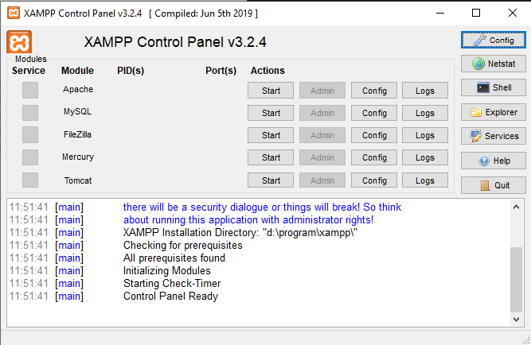

# Gallery with images of birds
The gallery is an infinite-scroll page with images of birds.

## Getting started
If you just want a get a quick look and feel of the page you can access it on https://martinmarklund.github.io/.

Otherwise you can use a local server, I can personally recommend XAMPP for an easy setup. To get a local server running with XAMPP, follow these steps:
1. Download the latest version of XAMPP for your system from https://xampp.site/.
2. Follow the installer instructions to install XAMPP on your system.
3. Head over to the location where you installed XAMPP and open the folder *htdocs*.
4. Copy the entire project folder into the 'htdocs' folder. If it is zipped, unzip it before copying it.
5. Launch the XAMPP control panel. You should get something like this: 
   
   
6. Start the *Apache* module with the button under *Actions*.
7. Open your web browser of choice and surf into **localhost/BirdGallery**. (The page in its current state has been tested on the latest versions of *Chrome*, *Edge* and *Firefox*).
8. The gallery should now be up and running in your web browser.

In order to terminate the local server, stop the *Apache* module in the XAMPP control panel and close the web page.

**Note:** If you changed the name of the project folder, you must use that name instead when surfing into localhost.

## Features
* Infinite scrolling
* Content according to Web Content Accessibility Guidelines 
* **Lots of birds!**
## Project status
A known issue is that the API-key used to access Flickr's API is visible in the source code right now. Since the project, in its current state, is pure frontend and written in VanillaJS, there is no good way of hiding the API-key. However, since the scope of this project is that of a test, and the API-key holds no sensitive information, it should be fine. In a future relase (without these restrictions), the API-key could be hidden by hosting it on a server instead of leaving it in the source. Then the API-key version might need to be changed too, since right now it is a non-commercial key. However, this is easliy done via Flickr's app garden.

## Author
Martin Marklund  
martin.marklund@hotmail.se  
